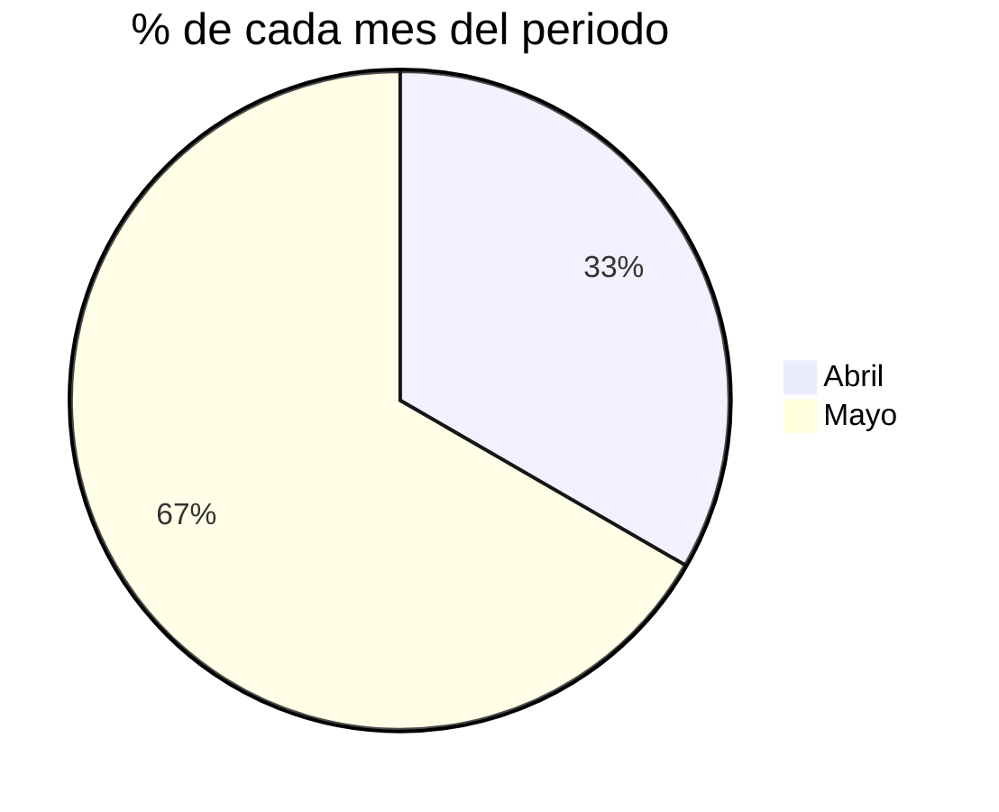

 

 
 
 
 
 
 
 
 
 
<h1 style="text-align:center"><b>GDMTH fórmulas 📌 </b> </h1>
 
 
 
 

## 🧾

## **Ejemplo de recibo:**

 

## **Proporción de cada mes 🗓️**

Primero que nada es necesario conocer el porcentaje que cubre cada mes del periodo total.
 
En el caso nuestro recibo cubre 100% el mes de marzo, ya que no se toma en cuenta el primer día.
 
Si el periodo fuera de: <b>19/Abr/2021-20/May/2021</b>
 
Total de días = 30 días
 
Abril cubre 10 días: el 33.33% del total.
 
Mayo cubre 20 días: el 66.66% del total.
 

Su gráfica se vería así:
 

Se realizarán <b>2 métodos</b>,

<ol>
<li>Para cuando sea claro que un mes cubre más que el otro mes se tomarán las tarifas del mes que cubra más porcentaje.
A este método le llamaremos <b>tarifas por mes</b>.</li>
<li>Para cuando no sea claro cuál es el mes que cubre más porcentaje, es decir cuando los 2 meses cubren la misma cantidad de días del periodo. A este método lo llamaremos <b>tarifas proporcionales.</b></li>

</ol>

## **Tarifas por mes 🗓️💵**

### **Suministro/Cargo fijo**

Para suministro solo se toma en cuenta la tarifa del mes que fue mayor.

$$Suministro=(Tarifa De Suministro Del Mes)$$

### **Distribución**

Para distribución se necesita obtener kwh_total

$$kWh total=kWh base+kWh intermedia+ kWh punta$$

Para distribución se necesita obtener demanda distribución

$$DemandaDist=\frac{kWhtotal}{(24)(diasDelPeriodo)(F.C.)}=\frac{kWhtotal}{(24)(diasDelPeriodo)(0.57)}$$

F.C.=Factor de carga.
Este el un valor dado según Acuerdo A/064/2018 el factor de carga para GDMTH es = 0.57

  

$$DistribuciónTotal=(TarifaDeDistribuciónDeEseMes)(DemandaDist)$$

### **Transmisión**

$$kWhtotal=kWh base+kWh intermedia+ kWh punta$$

$$TransmisiónTotal=(kWhtotal)(Tarifa DeTransmisión De Ese Mes)$$
### **CENACE**
$$kWhtotal=kWh base+kWh intermedia+ kWh punta$$
$$CENACE=(kWhtotal)(Tarifa De CENACE De Ese Mes)$$

### **Generación B**
$$GenB=(kWh base)(Tarifa De GenB De Ese Mes)$$

### **Generación I**
$$GenI=(kWh intermedio)(Tarifa De GenI De Ese Mes)$$

### **Generación P**
$$GenP=(kWh punta)(Tarifa De GenP De Ese Mes)$$

### **Capacidad**

Para la capacidad se necesita de la demanda capacidad

$$DemandaCapacidad=mín (kW punta,\frac{kWhtotal}{(24)(d)(F.C.)})$$

<b>kW punta </b>viene en el recibo.

$$kWhtotal=kWh base+kWh intermedia+ kWh punta$$
<b>d=</b> días del periodo

<b>F.C. = </b> Factor de carga = 0.57
Según Acuerdo A/064/2018 el factor de carga para GDMTH es = 0.57

$$CapacidadTotal=(Tarifa DeCapacidad De Ese Mes)(DemandaCapacidad )$$

### **SCnMEM**

$$kWhtotal=kWh base+kWh intermedia+ kWh punta$$
$$SCnMEM=(kWhtotal )(Tarifa De SCnMEM De Ese Mes)$$

### **Energía**

  

$$Energía=DistribuciónTotal+ Transmisiónotal+CENACE+GenB+GenI+GenP+CapacidadTotal+SCnMEM$$

### **2% Baja tensión**

  

$$ 2Baja tensión=(Energía+\frac{Cargo Fijo}{Suministro})(0.02)$$
